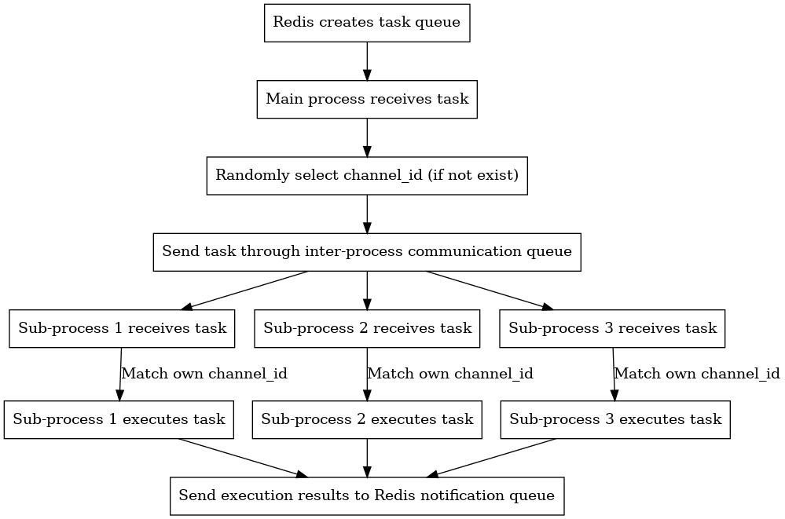

中文说明[README_CN.md](README_CN.md)
# midjourney-python-api
This is a Python client for the unofficial MidJourney API, This implementation uses a Discord self bot, and utilizes this library: Merubokkusu/Discord-S.C.U.M. Please be aware that there might be a risk of being banned.


### *** risky actions: [issue #66](https://github.com/Merubokkusu/Discord-S.C.U.M/issues/66#issue-876713938)

## Key Features
- [x] Info
- [x] Imagine prompt
- [x] Image Upscale and Vectorize by label
- [x] All messages return via WebSocket, including banned words check and image processing
- [x] Auto reconnect WebSocket
- [x] status for execute command (imagine, interact), failed or success

## Planned Features
- [x] Multi-account support
- [ ] Full support for all MidJourney APIs


### Setup, choose one of the following methods

#### by pip
```bash
# use pip, create visual env
python -m venv .venv 
pip install -r requirements.txt
```


### by poetry
```bash
poetry install
```

## Configuration

## copy the config file and edit it, you can set all accounts in the config file
```bash
cp config.example.py config.py
```

### Start the main Services

```python
python main.py
```

## Start test client to listen redis messages

```python
python client.py
```

## Start test client to send redis messages to test

```python
python test.py
```

## Technical Principles:

Multiple accounts need to be configured in `config.py`, each account requires the following fields: `name`, `token`, `application_id`, `guild_id` and `channel_id`.

The Python program will start two threads:

1. One thread is used to receive messages from Redis and dispatch to subprocesses.

2. The other thread is used to manage subprocesses.

The subprocess management thread will start one process for each account based on account configurations. Each process will have two threads:

1. Redis receiving thread: receive tasks and assemble messages. The message queue name is \`midjounery_task\`. The message format is as follows:

```
{
  "cmd": string, command to execute, currently supports "imagine" and "interact",

  "args": array, arguments passed to the command, "imagine" only has one string "prompt", "interact" has two params "message_id" and "label",

  "channel_id": which channel to send the execution to, "imagine" can be omitted, program will randomly schedule across accounts, "interact" must pass the correct "channel_id".
}
```

2. Redis sending thread: sends real-time WSS messages. The message queue name is \`midjounery_notification\`.

The program flow is as follows:

1. Send messages from Redis task queue.

2. The main process receives the message, and randomly selects a channel if "channel_id" is not present.

3. Send to each subprocess through inter-process communication queue.

4. Each account subprocess will receive this message, but only process tasks matching its own "channel_id", other tasks will be ignored.

5. After receiving the task, the subprocess will call its internal function to execute.

6. The execution result is listened via WSS, then sent externally via Redis queue.
```




## Discussion
- discord : https://discord.gg/AJSGUVeMd9

## Donation
Loved the project? Condider buy me a coffee :D [Kofi](https://ko-fi.com/ezioruan)
